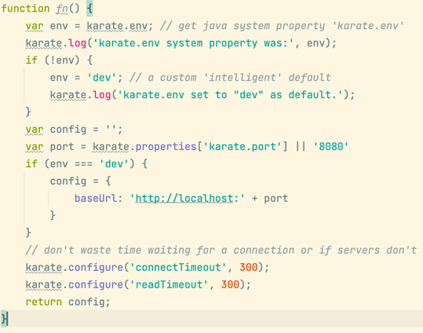
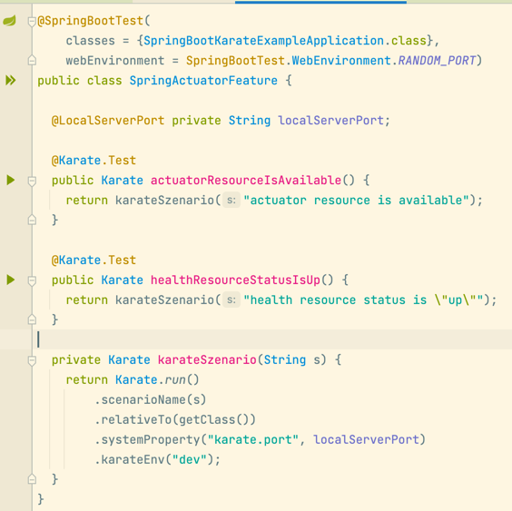
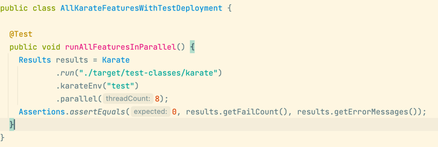

# Example project with Spring-Boot and Karate

[](https://github.com/42talents/spring-boot-karate-example/actions/workflows/maven.yml)


## 3 Ways to run Karate Tests for Spring-Boot Applications.


<sub>
Photo by <a href="https://unsplash.com/@agk42?utm_source=unsplash&utm_medium=referral&utm_content=creditCopyText">Alex Knight</a> on <a href="https://unsplash.com/s/photos/automation?utm_source=unsplash&utm_medium=referral&utm_content=creditCopyText">Unsplash</a>
</sub>

### What is the Karate Framework?
Karate's slogan is **Test Automation Made Simple**. It is a test framework based on Cucumber to write web application tests quickly. You can use it as an alternative to REST-assured API testing.

### Karate Setup within a Spring-Boot Project
Karate comes as a test dependency. In this example, we use maven.
```xml
<dependency>
    <groupId>com.intuit.karate</groupId>
    <artifactId>karate-junit5</artifactId>
    <version>1.2.0</version>
    <scope>test</scope>
</dependency>
```

### Example Karate Test
You write Karate tests in Gherkin. We use a BDD style here. The following example shows how to verify that the spring-boot health actuator resource shows "up".
```gherkin
Scenario: health resource status is "up"
  Given url baseUrl + '/actuator/health'
  When method get
  Then status 200
  And match response == {'status':'UP'}
```


### 1. Execute the karate feature file with IntelliJ IDEA.

You can run the karate feature file directly from the editor in IntelliJ, as shown in the GIF below or use the shortcut to run the current scenario.


You can define variables used in the tests in the test-resource file "karate-config.js". Here we set the variable *baseUrl* depending on the environment. Localhost is our default environment. Karate calls this configuration function for every scenario.



This way, you can run an entire feature or a single scenario. But, this requires the application to be running.


### 2. Execute scenarios with JUnit.

A second way to run the feature files is with JUnit. The following picture shows a basic JUnit test to run the karate test.



The SpringBootTest is used to bootstrap the server and supply the local server port as a system property to karate. This system property is then used during the karate configuration to configure the *baseUrl* variable.

To run these tests during the integration test phase with maven, you must configure the maven-failsafe-plugin accordingly.

```xml
<plugin>
    <groupId>org.apache.maven.plugins</groupId>
    <artifactId>maven-failsafe-plugin</artifactId>
    <configuration>
        <includes>**/*Feature.java</includes>
    </configuration>
</plugin>
```


### 3. Execute all feature files in parallel with the deployed application.

When you want to verify your deployed application, you can run all feature files in parallel.
For this, you can also use JUnit to initialize the karate test runner and then let karate execute the features in parallel.
In the example shown below, we configure karate to use up to eight threads in parallel.




### Conclusion

In my daily work, I use all three ways.
During development, I run the feature files directly and do acceptance-test-driven development.
I use the JUnit scenario tests in the CI pipeline to prevent bugs.
To be sure that the deployed application is running as expected, the pipeline executes the "all features test" after a successful deployment.

An example application is available at https://github.com/42talents/spring-boot-karate-example.

Happy coding with ❤️ from Bern.
